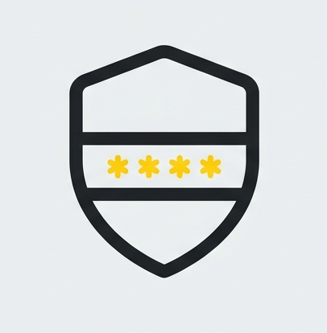

<p align="center">
  
</p>

# Confidential Hub

Confidential Hub is a production-oriented Sepolia dApp for the Zama Developer Program Season 3 Confidential Wrapper Registry bounty. It turns the Sepolia Wrappers Registry into a wallet experience for browsing official ERC-20 to ERC-7984 pairs, claiming faucet tokens, shielding, unshielding, and decrypting confidential balances.

Live app: https://confidential-hub.vercel.app/

GitHub repository: https://github.com/Kien7502/confidential-hub

## Zama Challenge And References

This project was built for the Zama Developer Program Season 3 bounty track, "Confidential Wrapper Registry App". The challenge asks for a public, production-ready Sepolia dApp that surfaces the official ERC-20 to ERC-7984 wrapper registry, supports wrapping and unwrapping, decrypts ERC-7984 balances through the user-decryption flow, and includes a faucet flow for the official Sepolia cTokenMocks.

Official Zama pages used by this repository:

- Sepolia Wrappers Registry and official token list: https://docs.zama.org/protocol/protocol-apps/addresses/testnet/sepolia#wrappers-registry
- Wrapper Registry documentation: https://docs.zama.org/protocol/protocol-apps/confidential-tokens/wrapper-registry
- Confidential Wrapper documentation: https://docs.zama.org/protocol/protocol-apps/confidential-tokens/confidential-wrapper
- Zama SDK documentation: https://docs.zama.org/protocol/sdk
- Legacy Relayer SDK repository: https://github.com/zama-ai/relayer-sdk
- FHEVM Solidity guides: https://docs.zama.org/protocol/solidity-guides

The local challenge brief is kept in `docs/challenge.md` so reviewers can see the exact submission checklist used while building the app.

## Supported Network

- Sepolia only
- Chain ID: `11155111`
- Wrappers Registry: `0x2f0750Bbb0A246059d80e94c454586a7F27a128e`

Wallet actions are disabled until the connected wallet is on Sepolia. The frontend uses a public Sepolia RPC for read-only registry, metadata, balance, and handle reads.

## Features

- Browse official Sepolia ERC-20 to ERC-7984 wrapper pairs.
- Surface every documented official Sepolia cTokenMock pair from Zama's Sepolia addresses page:
  - `cUSDCMock`: wrapper `0x7c5BF43B851c1dff1a4feE8dB225b87f2C223639`, underlying `0x9b5Cd13b8eFbB58Dc25A05CF411D8056058aDFfF`
  - `cUSDTMock`: wrapper `0x4E7B06D78965594eB5EF5414c357ca21E1554491`, underlying `0xa7dA08FafDC9097Cc0E7D4f113A61e31d7e8e9b0`
  - `cWETHMock`: wrapper `0x46208622DA27d91db4f0393733C8BA082ed83158`, underlying `0xff54739b16576FA5402F211D0b938469Ab9A5f3F`
  - `cBRONMock`: wrapper `0xaa5612FA27c927a0c7961f5AEFEE5ba3A0F9C891`, underlying `0xFf021fB13cA64e5354c62c954b949a88cfDEb25E`
  - `cZAMAMock`: wrapper `0xf2D628d2598aF4eAF94CB76a437Ff86CA78FfbFB`, underlying `0x75355a85c6FB9df5f0C80FF54e8747EEe9a0BF57`
  - `ctGBPMock`: wrapper `0xfCE5c7069c5525eF6c8C2b2E35A745bA20a2F7CC`, underlying `0x93c931278A2aad1916783F952f94276eA5111442`
  - `cXAUtMock`: wrapper `0xe4FcF848739845BC81Dee1d5352cf3844F0a60C7`, underlying `0x24377AE4AA0C45ecEe71225007f17c5D423dd940`
- Show the restricted official `ctGBP` pair without a public faucet.
- Claim official mock underlying tokens through `mint(address,uint256)`, capped at 1,000,000 tokens per call.
- Shield ERC-20 tokens by checking allowance, sending approval when needed, waiting for receipt confirmation, then calling `wrap(to, amount)`.
- Request unshield from ERC-7984 back to ERC-20 and keep pending unwrap requests in local storage for resume/finalize UX.
- Decrypt connected-wallet ERC-7984 balances with explicit EIP-712 signing.
- Decrypt arbitrary pasted ERC-7984 token addresses outside the registry.
- Cache ciphertext balance handles per chain, wallet, token, and handle so returning users do not repeat decrypt setup when the handle has not changed.
- Add existing ERC-20 or ERC-7984 wrapper contracts locally.
- Create custom ERC-20s and ERC-7984 wrapper contracts from the app using the bundled contract artifacts.

## Registry Source Model

The onchain Sepolia Wrappers Registry is the primary source of truth.

The registry contract address is sourced from Zama's Sepolia addresses page:

```text
Wrappers Registry: 0x2f0750Bbb0A246059d80e94c454586a7F27a128e
Source: https://docs.zama.org/protocol/protocol-apps/addresses/testnet/sepolia#wrappers-registry
```

The app reads registry data through:

```solidity
getTokenConfidentialTokenPairs()
getTokenConfidentialTokenPairsSlice(uint256 fromIndex, uint256 toIndex)
getConfidentialTokenAddress(address token)
getTokenAddress(address confidentialToken)
isConfidentialTokenValid(address confidentialToken)
```

Each pair is enriched with ERC-20/ERC-7984 metadata and wrapper `rate()`. Active wrap/unshield actions are exposed only when the pair is valid. A non-zero registry mapping is not trusted by itself because mappings can be revoked.

Local config is a secondary extension layer:

- Official documented pairs live in `frontend/src/config/officialPairs.ts`.
- Custom or development-only pairs live in `frontend/src/config/localPairs.ts`.

The official pair config is copied from Zama's Sepolia "Confidential wrappers" table. That table provides the wrapper address, underlying token address, symbol, and faucet availability for each official Sepolia wrapper. The mocked wrappers are marked by Zama as public mint wrappers with a 1,000,000-token-per-call limit. The app uses that list to provide friendly labels and faucet controls, while the onchain registry still decides whether a pair is valid for active wrap and unshield actions.

The app merges onchain registry reads with the curated config so official cTokenMocks remain easy to inspect while still preserving registry validity checks. Local entries never replace registry truth; they only let developers test or demonstrate custom ERC-20 to ERC-7984 pairs before those pairs are officially registered.

## Add A New Pair

Use `frontend/src/config/localPairs.ts` for custom or development-only pairs that are not part of the official registry yet.

```ts
import type { LocalPairConfig } from "../types";

export const localPairs: LocalPairConfig[] = [
  {
    id: "my-dev-usdc-wrapper",
    source: "local",
    underlyingAddress: "0xYourErc20Address",
    confidentialAddress: "0xYourErc7984WrapperAddress",
    underlying: {
      name: "My Dev USDC",
      symbol: "mUSDC",
      decimals: 6
    },
    confidential: {
      name: "Confidential My Dev USDC",
      symbol: "cmUSDC",
      decimals: 6
    },
    supportsFaucet: false,
    notes: "Development wrapper used for local testing."
  }
];
```

Rules for adding a pair:

- The wrapper must expose `underlying()` and `rate()`.
- The underlying token must expose ERC-20 metadata: `name`, `symbol`, and `decimals`.
- The confidential wrapper must expose ERC-7984-compatible metadata and `confidentialBalanceOf`.
- If the pair is official, the registry `isValid` result must be true before active wrap/unshield buttons are shown.
- If it is local-only, the app labels it as user/local sourced and still reads metadata onchain.

Users can also add existing tokens from the UI. Pasting a cToken wrapper address previews both the underlying token metadata and the confidential wrapper metadata before the user confirms.

For an official ecosystem pair, the long-term path is to register the pair in the Zama Wrappers Registry through the registry owner process described in the Zama registry documentation. The frontend can still list a local pair while it is being developed, but it will label the pair as local/user sourced until the onchain registry returns `isValid = true`.

## Project Structure

```text
frontend/
  src/
    config/          Sepolia constants, ABIs, official/local pairs
    lib/             registry reads, transactions, SDK helpers, storage, tests
    App.tsx          wallet app shell and user flows
  scripts/
    sepolia-smoke.mjs
contract/
  contracts/         deployable ERC-20 and ERC-7984 helper contracts
  scripts/
    export-artifacts.mjs
docs/
  zama-docs-notes.md challenge-critical address and flow notes
  test-report.md     Sepolia smoke-test evidence
```

## Run Locally

Prerequisites:

- Node.js `>=22`
- A Privy app ID for wallet login
- A Sepolia wallet with ETH for transaction testing

```bash
cd frontend
cp .env.example .env.local
# set VITE_PRIVY_APP_ID in .env.local
npm install
npm run dev
```

Windows PowerShell equivalent:

```powershell
cd frontend
Copy-Item .env.example .env.local
# set VITE_PRIVY_APP_ID in .env.local
npm install
npm run dev
```

## Build And Test

```bash
cd frontend
npm test
npm run build
```

Sepolia smoke test:

```bash
cd frontend
cp .env.test.local.example .env.test.local
# set SEPOLIA_PRIVATE_KEY to a funded disposable Sepolia key
npm run test:sepolia
```

By default `SEPOLIA_ENABLE_TXS=false`, so the smoke script performs read-only checks: RPC chain, wallet ETH balance, registry mapping, wrapper validity, metadata, wrapper rate, balances, and confidential handle reads.

Set `SEPOLIA_ENABLE_TXS=true` only for a disposable funded wallet. The transaction path mints official mock underlying tokens, approves the wrapper if needed, wraps the configured amount, and confirms that the confidential handle becomes non-zero.

## Deployment

The repository includes `vercel.json`:

```json
{
  "buildCommand": "cd frontend && npm install && npm run build",
  "outputDirectory": "frontend/dist",
  "framework": null,
  "rewrites": [
    {
      "source": "/(.*)",
      "destination": "/index.html"
    }
  ]
}
```

Deploy to Vercel:

```bash
npm install -g vercel
vercel deploy --prod
```

Or deploy from the `frontend/` directory:

```bash
cd frontend
npm install
npm run build
npx vercel deploy --prod
```

Set `VITE_PRIVY_APP_ID` in the Vercel project environment variables.

## Demo Video Checklist

The bounty demo video must be real-person pitch only, maximum 3 minutes. Suggested order:

1. Open Confidential Hub and show the official registry-backed token list.
2. Connect a wallet on Sepolia.
3. Claim one official mock underlying token from Faucet.
4. Shield the mock ERC-20 into its cTokenMock wrapper.
5. Decrypt the resulting ERC-7984 balance through the EIP-712 flow.
6. Request unshield back to the ERC-20 side and show the pending/finalize UX.
7. Paste an arbitrary ERC-7984 token address outside the registry and decrypt/read its confidential balance.
8. Briefly show `frontend/src/config/localPairs.ts` and explain the new-pair process.

## X Thread / Article Outline

- Introduce Confidential Hub as a Sepolia wrapper registry app for Zama ERC-7984 tokens.
- Explain the problem: testnet wrapper fragmentation and duplicate confidential assets.
- Show the core flows: browse registry, faucet, shield, decrypt, unshield.
- Explain extensibility through local pair config plus onchain registry validation.
- Link the live app, https://confidential-hub.vercel.app/, and the public GitHub repository.
